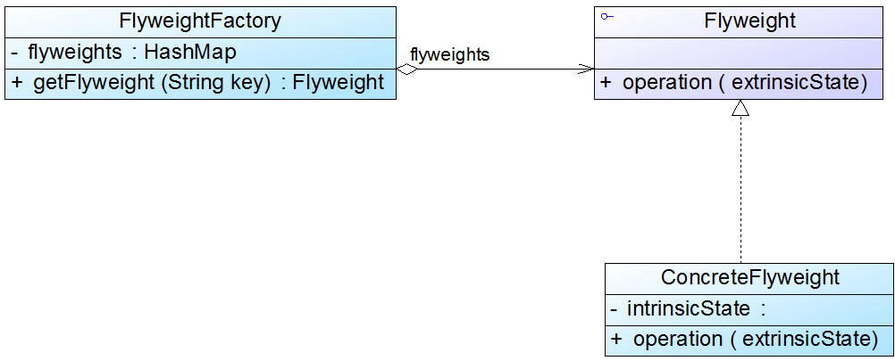

# 享元模式(Flyweight Pattern)
享元模式以共享的方式高效地支持大量细粒度对象的重用，享元对象能做到共享的关键是区分了内部状态(Intrinsic State)和外部状态(Extrinsic State)
*  内部状态是存储在享元对象内部并且不会随环境改变而改变的状态，内部状态可以共享
*  外部状态是随环境改变而改变的、不可以共享的状态

Note:java中的IntegerCache.IntegerCache
## 定义
享元模式(Flyweight Pattern)：运用共享技术有效地支持大量细粒度对象的复用。系统只使用少量的对象，而这些对象都很相似，状态变化很小，可以实现对象的多次复用。由于享元模式要求能够共享的对象必须是细粒度对象，因此它又称为轻量级模式，它是一种对象结构型模式


## 角色
*  Flyweight（抽象享元类）
*  ConcreteFlyweight（具体享元类）
*  UnsharedConcreteFlyweight（非共享具体享元类）
*  FlyweightFactory（享元工厂类）

```
class FlyweightFactory {
    //定义一个HashMap用于存储享元对象，实现享元池
       private HashMap flyweights = newHashMap();
      
       public Flyweight getFlyweight(String key){
              //如果对象存在，则直接从享元池获取
              if(flyweights.containsKey(key)){
                     return(Flyweight)flyweights.get(key);
              }
              //如果对象不存在，先创建一个新的对象添加到享元池中，然后返回
              else {
                     Flyweight fw = newConcreteFlyweight();
                     flyweights.put(key,fw);
                     return fw;
              }
       }
}

class Flyweight {
     //内部状态intrinsicState作为成员变量，同一个享元对象其内部状态是一致的
       private String intrinsicState;
      
       public  Flyweight(String intrinsicState) {
              this.intrinsicState=intrinsicState;
       }
      
        //外部状态extrinsicState在使用时由外部设置，不保存在享元对象中，即使是同一个对象，在每一次调用时也可以传入不同的外部状态
       public void operation(String  extrinsicState) {
              ......
       }     
}


```

## 单纯享元模式和复合享元模式
### 单纯享元模式
在单纯享元模式中，所有的具体享元类都是可以共享的，不存在非共享具体享元类



### 复合享元模式
将一些单纯享元对象使用组合模式加以组合，还可以形成复合享元对象，这样的复合享元对象本身不能共享，但是它们可以分解成单纯享元对象，而后者则可以共享


## 优点
*  可以极大减少内存中对象的数量，使得相同或相似对象在内存中只保存一份，从而可以节约系统资源，提高系统性能
*  享元模式的外部状态相对独立，而且不会影响其内部状态，从而使得享元对象可以在不同的环境中被共享

## 缺点
*  享元模式使得系统变得复杂，需要分离出内部状态和外部状态，这使得程序的逻辑复杂化
*  为了使对象可以共享，享元模式需要将享元对象的部分状态外部化，而读取外部状态将使得运行时间变长

## 适用场景
*  一个系统有大量相同或者相似的对象，造成内存的大量耗费
*  对象的大部分状态都可以外部化，可以将这些外部状态传入对象中
*  在使用享元模式时需要维护一个存储享元对象的享元池，而这需要耗费一定的系统资源，因此，应当在需要多次重复使用享元对象时才值得使用享元模式。