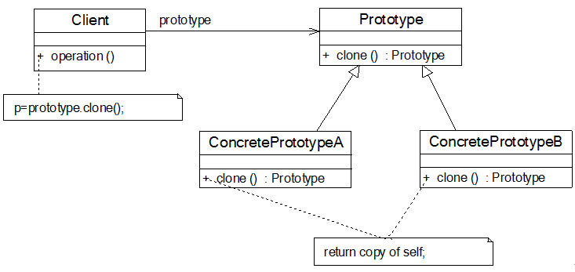

# 原型模式
## 定义
原型模式(Prototype  Pattern)：使用原型实例指定创建对象的种类，并且通过拷贝这些原型创建新的对象。原型模式是一种对象创建型模式



## 角色
*  Prototype（抽象原型类）
*  ConcretePrototype（具体原型类）
*  Client（客户类）

## 示例代码
```
class ConcretePrototype implements Prototype{
    private String  attr; //成员属性
    public void  setAttr(String attr){
        this.attr = attr;
    }
    public String  getAttr(){
        return this.attr;
    }
    public Prototype  clone(){
        Prototype  prototype = new ConcretePrototype(); //创建新对象
        prototype.setAttr(this.attr);
        return prototype;
    }
}
```

## 浅克隆 VS 深克隆

## 优点
*  当创建新的对象实例较为复杂时，使用原型模式可以简化对象的创建过程，通过复制一个已有实例可以提高新实例的创建效率
*  扩展性较好，由于在原型模式中提供了抽象原型类，在客户端可以针对抽象原型类进行编程，而将具体原型类写在配置文件中，增加或减少产品类对原有系统都没有任何影响
*  原型模式提供了简化的创建结构，工厂方法模式常常需要有一个与产品类等级结构相同的工厂等级结构，而原型模式就不需要这样，原型模式中产品的复制是通过封装在原型类中的克隆方法实现的，无须专门的工厂类来创建产品
*  可以使用深克隆的方式保存对象的状态，使用原型模式将对象复制一份并将其状态保存起来，以便在需要的时候使用（如恢复到某一历史状态），可辅助实现撤销操作

## 缺点
*  需要为每一个类配备一个克隆方法，而且该克隆方法位于一个类的内部，当对已有的类进行改造时，需要修改源代码，违背了“开闭原则”
*  在实现深克隆时需要编写较为复杂的代码，而且当对象之间存在多重的嵌套引用时，为了实现深克隆，每一层对象对应的类都必须支持深克隆，实现起来可能会比较麻烦

## 适用场景
*  创建新对象成本较大
*  如果系统要保存对象的状态，而对象的状态变化很小，或者对象本身占用内存较少时，可以使用原型模式配合备忘录模式来实现
*  需要避免使用分层次的工厂类来创建分层次的对象