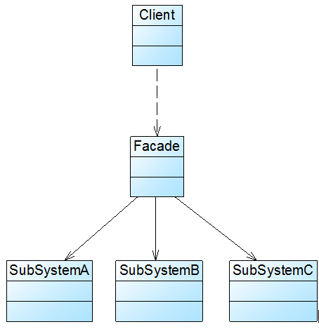

# 外观模式(Facade Pattern)

## 定义
外观模式(Facade Pattern)：为子系统中的一组接口提供一个统一的入口。外观模式定义了一个高层接口，这个接口使得这一子系统更加容易使用



## 角色
*  Facade（外观角色）
*  SubSystem（子系统角色）

```
class SubSystemA  {  
    public void MethodA()  {  
        //业务实现代码  
    }  
}  
  
class SubSystemB  {  
    public void MethodB()  {  
        //业务实现代码  
     }  
}  
  
class SubSystemC  {  
    public void MethodC()  {  
        //业务实现代码  
    }  
}  

class Facade  {  
    private SubSystemA obj1 = new SubSystemA();  
    private SubSystemB obj2 = new SubSystemB();  
    private SubSystemC obj3 = new SubSystemC();  
  
    public void Method()  {  
        obj1.MethodA();  
        obj2.MethodB();  
        obj3.MethodC();  
    }  
} 
```

## 优点
*  它对客户端屏蔽了子系统组件，减少了客户端所需处理的对象数目，并使得子系统使用起来更加容易
*  它实现了子系统与客户端之间的松耦合关系，这使得子系统的变化不会影响到调用它的客户端，只需要调整外观类即可
*  一个子系统的修改对其他子系统没有任何影响，而且子系统内部变化也不会影响到外观对象

## 缺点
*  不能很好地限制客户端直接使用子系统类，如果对客户端访问子系统类做太多的限制则减少了可变性和灵活性
*  如果设计不当，增加新的子系统可能需要修改外观类的源代码，违背了开闭原则

## 适用场景
*  当要为访问一系列复杂的子系统提供一个简单入口时可以使用外观模式
*  客户端程序与多个子系统之间存在很大的依赖性。
*   在层次化结构中，可以使用外观模式定义系统中每一层的入口，层与层之间不直接产生联系，而通过外观类建立联系，降低层之间的耦合度

