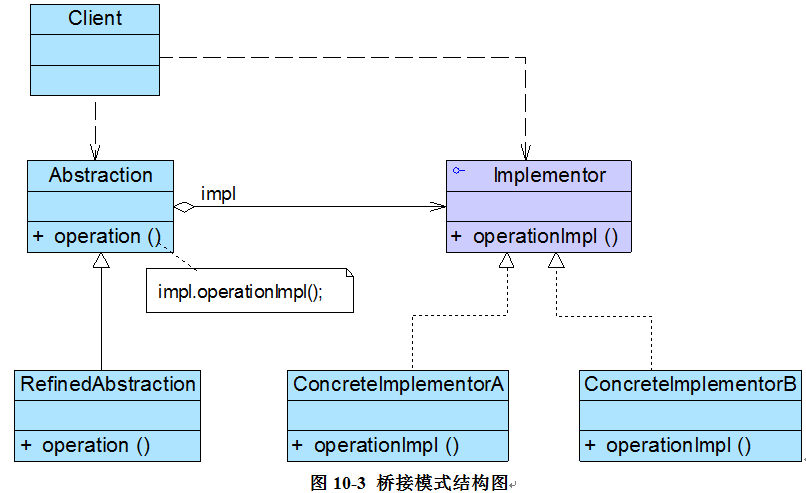

# 桥接模式
桥接模式是一种很实用的结构型设计模式，如果软件系统中某个类存在两个独立变化的维度，通过该模式可以将这两个维度分离出来，使两者可以独立扩展，让系统更加符合“单一职责原则”。与多层继承方案不同，它将两个独立变化的维度设计为两个独立的继承等级结构，并且在抽象层建立一个抽象关联，该关联关系类似一条连接两个独立继承结构的桥，故名桥接模式

## 定义
桥接模式(Bridge Pattern)：将抽象部分与它的实现部分分离，使它们都可以独立地变化。它是一种对象结构型模式，又称为柄体(Handle and Body)模式或接口(Interface)模式。



## 角色
*  Abstraction（抽象类）
*  RefinedAbstraction（扩充抽象类）
*  Implementor（实现类接口）
*  ConcreteImplementor（具体实现类）

```
abstract class Abstraction {  
    protected Implementor impl; //定义实现类接口对象  
      
    public void setImpl(Implementor impl) {  
        this.impl=impl;  
    }  
      
    public abstract void operation();  //声明抽象业务方法  
}  

class RefinedAbstraction extends Abstraction {  
    public void operation() {  
        //业务代码  
        impl.operationImpl();  //调用实现类的方法  
        //业务代码  
    }  
} 

interface Implementor {  
    public void operationImpl();  
} 

```

## 优点
*  分离抽象接口及其实现部分
*  在很多情况下，桥接模式可以取代多层继承方案，多层继承方案违背了“单一职责原则”，复用性较差，且类的个数非常多，桥接模式是比多层继承方案更好的解决方法，它极大减少了子类的个数
*  桥接模式提高了系统的可扩展性，在两个变化维度中任意扩展一个维度，都不需要修改原有系统，符合“开闭原则”

## 缺点
*  桥接模式的使用会增加系统的理解与设计难度，由于关联关系建立在抽象层，要求开发者一开始就针对抽象层进行设计与编程
*  桥接模式要求正确识别出系统中两个独立变化的维度，因此其使用范围具有一定的局限性，如何正确识别两个独立维度也需要一定的经验积累
