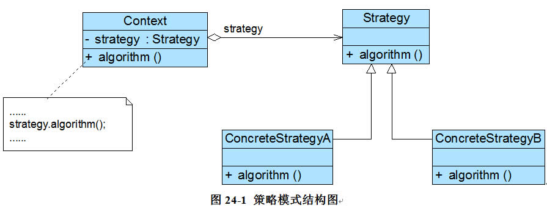

# 策略模式
实现某一个功能有多条途径，每一条途径对应一种算法，此时我们可以使用一种设计模式来实现灵活地选择解决途径，也能够方便地增加新的解决途径

策略模式的主要目的是将算法的定义与使用分开，也就是将算法的行为和环境分开，将算法的定义放在专门的策略类中，每一个策略类封装了一种实现算法，使用算法的环境类针对抽象策略类进行编程，符合“依赖倒转原则”。在出现新的算法时，只需要增加一个新的实现了抽象策略类的具体策略类即可
## 定义
策略模式(Strategy Pattern)：定义一系列算法类，将每一个算法封装起来，并让它们可以相互替换，策略模式让算法独立于使用它的客户而变化，也称为政策模式(Policy)。策略模式是一种对象行为型模式



## 角色
*  Context（环境类）
*  Strategy（抽象策略类）
*  ConcreteStrategy（具体策略类）

```
abstract class AbstractStrategy {  
    public abstract void algorithm(); //声明抽象算法  
} 

class ConcreteStrategyA extends AbstractStrategy {  
    //算法的具体实现  
    public void algorithm() {  
       //算法A  
    }  
}  

class Context {  
    private AbstractStrategy strategy; //维持一个对抽象策略类的引用  
  
    public void setStrategy(AbstractStrategy strategy) {  
        this.strategy= strategy;  
    }  
  
    //调用策略类中的算法  
    public void algorithm() {  
        strategy.algorithm();  
    }  
}

```

策略模式提供了一种可插入式(Pluggable)算法的实现方案

## 优点
*  策略模式提供了对“开闭原则”的完美支持，用户可以在不修改原有系统的基础上选择算法或行为，也可以灵活地增加新的算法或行为
*  策略模式提供了管理相关的算法族的办法
*  策略模式提供了一种可以替换继承关系的办法
*  使用策略模式可以避免多重条件选择语句
*  策略模式提供了一种算法的复用机制

## 缺点
*  客户端必须知道所有的策略类，并自行决定使用哪一个策略类
*  策略模式将造成系统产生很多具体策略类
*  无法同时在客户端使用多个策略类

## 适用场景
*  一个系统需要动态地在几种算法中选择一种，那么可以将这些算法封装到一个个的具体算法类中，而这些具体算法类都是一个抽象算法类的子类。换言之，这些具体算法类均有统一的接口，根据“里氏代换原则”和面向对象的多态性，客户端可以选择使用任何一个具体算法类，并只需要维持一个数据类型是抽象算法类的对象
*  一个对象有很多的行为，如果不用恰当的模式，这些行为就只好使用多重条件选择语句来实现。此时，使用策略模式，把这些行为转移到相应的具体策略类里面，就可以避免使用难以维护的多重条件选择语句
*  不希望客户端知道复杂的、与算法相关的数据结构，在具体策略类中封装算法与相关的数据结构，可以提高算法的保密性与安全性


