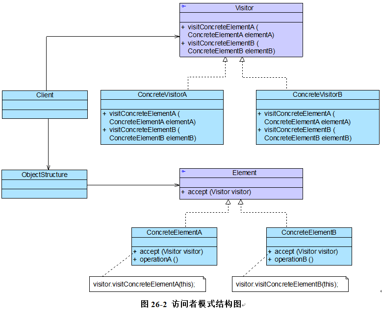

# 访问者模式
 访问者模式是一种较为复杂的行为型设计模式，它包含访问者和被访问元素两个主要组成部分，这些被访问的元素通常具有不同的类型，且不同的访问者可以对它们进行不同的访问操作。
 
## 定义
访问者模式(Visitor Pattern):提供一个作用于某对象结构中的各元素的操作表示，它使我们可以在不改变各元素的类的前提下定义作用于这些元素的新操作。访问者模式是一种对象行为型模式



## 角色
*  Visitor（抽象访问者）
*  ConcreteVisitor（具体访问者）
*  Element（抽象元素）
*  ConcreteElement（具体元素）
*  ObjectStructure（对象结构）

```
abstract class Visitor  
{  
    public abstract void visit(ConcreteElementA elementA);  
    public abstract void visit(ConcreteElementB elementB);  
    public void visit(ConcreteElementC elementC)  
    {  
        //元素ConcreteElementC操作代码  
    }  
} 

class ConcreteVisitor extends Visitor  
{  
    public void visit(ConcreteElementA elementA)  
    {  
        //元素ConcreteElementA操作代码  
    }  
    public void visit(ConcreteElementB elementB)  
    {  
        //元素ConcreteElementB操作代码  
    }  
}  

interface Element  
{  
    public void accept(Visitor visitor);  
}

class ConcreteElementA implements Element  
{  
    public void accept(Visitor visitor)  
    {  
        visitor.visit(this);  
    }  
      
    public void operationA()  
    {  
        //业务方法  
    }  
}  

class ObjectStructure  
{  
    private ArrayList<Element> list = new ArrayList<Element>(); //定义一个集合用于存储元素对象  
  
    public void accept(Visitor visitor)  
    {  
        Iterator i=list.iterator();  
          
        while(i.hasNext())  
        {  
            ((Element)i.next()).accept(visitor); //遍历访问集合中的每一个元素  
        }  
    }  
  
    public void addElement(Element element)  
    {  
        list.add(element);  
    }  
  
    public void removeElement(Element element)  
    {  
        list.remove(element);  
    }  
}

```

## 优点
*  增加新的访问操作很方便。使用访问者模式，增加新的访问操作就意味着增加一个新的具体访问者类，实现简单，无须修改源代码，符合“开闭原则”。
*  将有关元素对象的访问行为集中到一个访问者对象中，而不是分散在一个个的元素类中。类的职责更加清晰，有利于对象结构中元素对象的复用，相同的对象结构可以供多个不同的访问者访问。
*  让用户能够在不修改现有元素类层次结构的情况下，定义作用于该层次结构的操作

## 缺点
*  增加新的元素类很困难。在访问者模式中，每增加一个新的元素类都意味着要在抽象访问者角色中增加一个新的抽象操作，并在每一个具体访问者类中增加相应的具体操作，这违背了“开闭原则”的要求。
*  破坏封装。访问者模式要求访问者对象访问并调用每一个元素对象的操作，这意味着元素对象有时候必须暴露一些自己的内部操作和内部状态，否则无法供访问者访问
## 适用场景
*  一个对象结构包含多个类型的对象，希望对这些对象实施一些依赖其具体类型的操作。在访问者中针对每一种具体的类型都提供了一个访问操作，不同类型的对象可以有不同的访问操作。
*  需要对一个对象结构中的对象进行很多不同的并且不相关的操作，而需要避免让这些操作“污染”这些对象的类，也不希望在增加新操作时修改这些类。访问者模式使得我们可以将相关的访问操作集中起来定义在访问者类中，对象结构可以被多个不同的访问者类所使用，将对象本身与对象的访问操作分离。
*  对象结构中对象对应的类很少改变，但经常需要在此对象结构上定义新的操作。