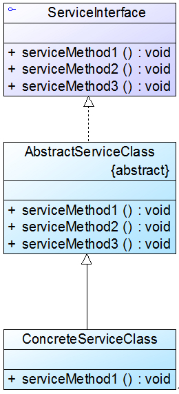

# 适配器模式(Adapter Pattern)
## 定义
适配器模式(Adapter Pattern)：将一个接口转换成客户希望的另一个接口，使接口不兼容的那些类可以一起工作，其别名为包装器(Wrapper)。适配器模式既可以作为类结构型模式，也可以作为对象结构型模式。

## 角色
*  Target（目标抽象类）
*  Adapter（适配器类）
*  Adaptee（适配者类）

## 对象适配器模式


```
class Adapter extends Target {  
    private Adaptee adaptee; //维持一个对适配者对象的引用  
      
    public Adapter(Adaptee adaptee) {  
        this.adaptee=adaptee;  
    }  
      
    public void request() {  
        adaptee.specificRequest(); //转发调用  
    }  
}  
```

## 类适配器模式


```
class Adapter extends Adaptee implements Target {  
    public void request() {  
        specificRequest();  
    }  
}
```

## 双向适配器模式


```
class Adapter implements Target,Adaptee {  
    //同时维持对抽象目标类和适配者的引用  
    private Target target;  
    private Adaptee adaptee;  
      
    public Adapter(Target target) {  
        this.target = target;  
    }  
      
    public Adapter(Adaptee adaptee) {  
        this.adaptee = adaptee;  
    }  
      
    public void request() {  
        adaptee.specificRequest();  
    }  
      
    public void specificRequest() {  
        target.request();  
    }  
}  
```

## 缺省适配器
缺省适配器模式(Default Adapter Pattern)：当不需要实现一个接口所提供的所有方法时，可先设计一个抽象类实现该接口，并为接口中每个方法提供一个默认实现（空方法），那么该抽象类的子类可以选择性地覆盖父类的某些方法来实现需求，它适用于不想使用一个接口中的所有方法的情况，又称为单接口适配器模式




## 优点
*  将目标类和适配者类解耦
*  增加了类的透明性和复用性
*  灵活性和扩展性都非常好

## 缺点
*  对于Java、C#等不支持多重类继承的语言，一次最多只能适配一个适配者类，不能同时适配多个适配者
*  适配者类不能为最终类，如在Java中不能为final类，C#中不能为sealed类
*   在Java、C#等语言中，类适配器模式中的目标抽象类只能为接口，不能为类


